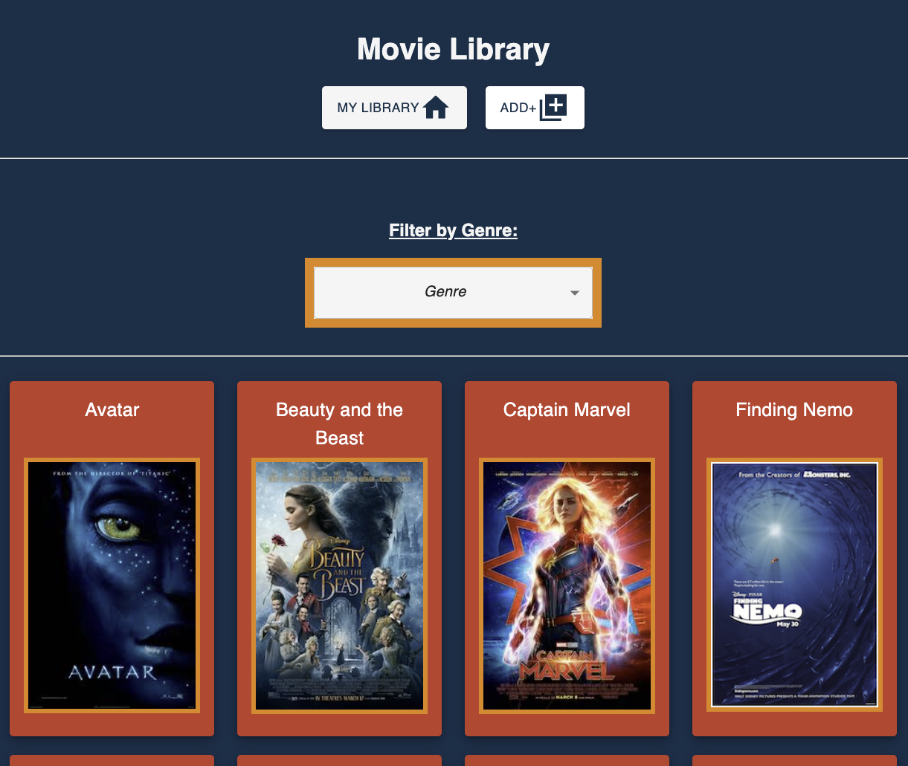

# Movie Library

## Description

*Duration 2 weeks*

The project was to create an app where you could add movies from your collection and filter them by genre. With digital purchases being all over the place, sometimes you forget that you might have a movie when you're looking for something to watch. This allows you to add movies to your current library and sort by genre. Current iteration just adds it with a description, movie poster, and genres. A long-term goal would be able to link current subscriptions to the app so you can auto-load purchases with a direct link to its location.

## Screenshots

___

## Prerequisites

- [Node.js](https://nodejs.org/en/)
- [API key with TMDB](https://developer.themoviedb.org/docs)
- [PostgreSQL](https://www.postgresql.org/)

## Installation

1. Create a PostgreSQL database with name: *saga_movies_weekend*
    - Port is set to 5432 by default
    - Change [here](server/modules/pool.js) to specify new port
2. Create the tables listed in [database.sql](database.sql)
    - Optional example data is provided there as well
3. Get an API key from [TMDB](https://developer.themoviedb.org/docs) if you don't already have one.
4. Create `.env` in the route directory.
5. Make your API key equal `TMDB_API_KEY`
    - Example: `TMDB_API_KEY = q2389748923wsdfkjsjkdhfiusady8` 
3. Open a terminal to the repo location and run `npm install`.
4. Run `npm run server` in your terminal.
    - Server is set to 5002 by default
    - Change [here](server/server.js) and [here](package.json) to set new port on localhost
5. Run `npm run client` in your terminal
6. `npm run client` should open a browser window to the project for you.

## Usage

Go to the add page. Search for the movies you want to add. Add them to your library and enjoy!

## Built with

- [Node.js](https://nodejs.org/en/)
- [TMDB](https://themoviedb.org/)
- [PostgreSQL](https://www.postgresql.org/)
- [Express.js](https://expressjs.com/)
- [React v18.2](https://react.dev/)
- [Axios](https://axios-http.com)
- [MUI](https://mui.com/)

## Acknowledgement
Thanks to [Prime Digital Academy](www.primeacademy.io) who equipped and helped me to make this application a reality, Chris Black for instruction, and [TMDB](https://themoviedb.org/) for having a free tier for devs like me!

## Support
If you have suggestions or issues, please email me at [j@8bit.coffee](mailto:j@8bit.coffee)